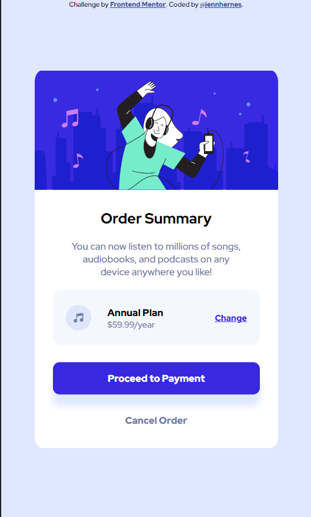

# Frontend Mentor - Order summary card solution

This is a solution to the [Order summary card challenge on Frontend Mentor](https://www.frontendmentor.io/challenges/order-summary-component-QlPmajDUj). Frontend Mentor challenges help you improve your coding skills by building realistic projects.

## Table of contents

- [Overview](#overview)
  - [The challenge](#the-challenge)
  - [Screenshot](#screenshot)
- [My process](#my-process)
  - [Built with](#built-with)
  - [What I learned](#what-i-learned)
  - [Continued development](#continued-development)
  - [Useful resources](#useful-resources)
- [Author](#author)


## Overview

### The challenge

Users should be able to:

- See hover states for interactive elements

### Screenshot



## My process

### Built with

- Flexbox
- Mobile-first workflow

### What I learned

This project was my first time using the flex property

```css
.plan__details {
    flex: 0 0 55%;
    display: flex;
    flex-direction: column;
    justify-content: space-around;
}
```

### Continued development

I want to learn more about naming conventions and semantic HTML

### Useful resources

- [Example resource 1](https://www.youtube.com/kepowob) - Kevin Powell's youtube channel is a really useful resource.

## Author

- Website - [Jenn Hernes](https://github.com/jennhernes/)
- Frontend Mentor - [@jennhernes](https://www.frontendmentor.io/profile/jennhernes)
